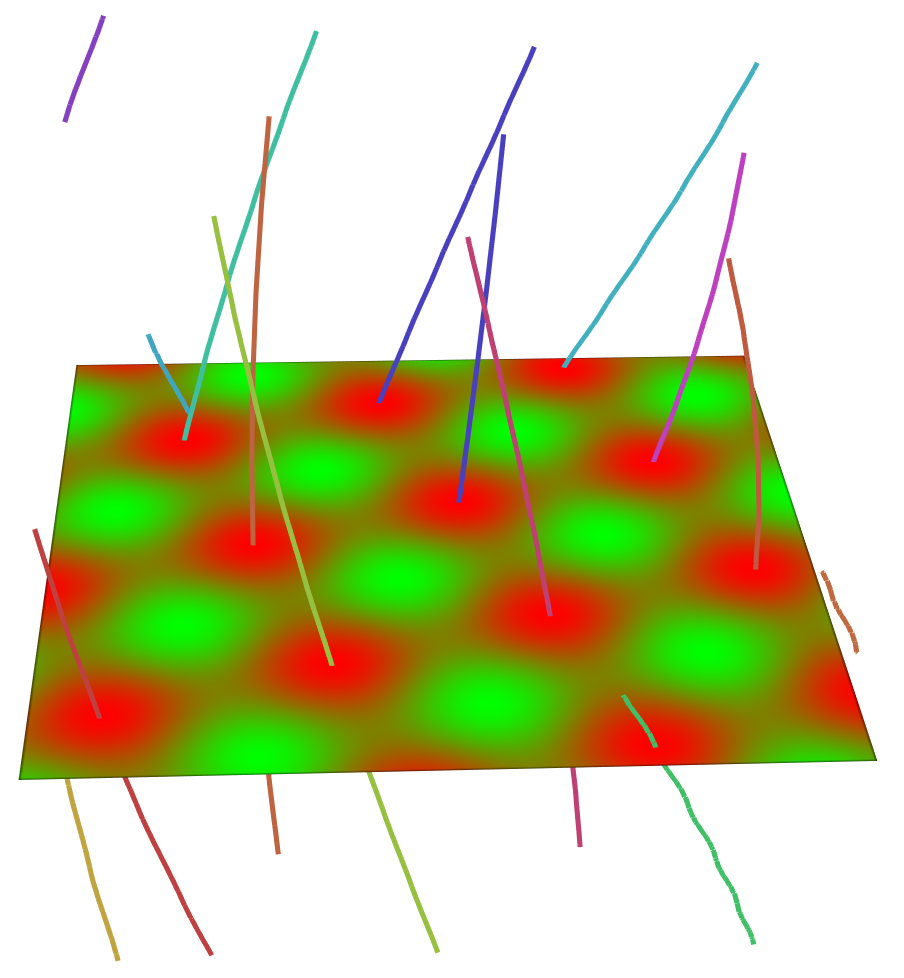

# FTK: The Feature Tracking Kit

FTK is a library that provides building blocks for feature tracking algorithms in scientific datasets.  FTK is header-only and written in C++17.  

## Major components in FTK

* Hypermesh: data structures for high-dimensional meshes and mesh elements including *n*-simplices, *n*-cubes, and *n*-prisms; utilities to generalize given 2D/3D structured/unstructured meshes into 3D/4D spacetime meshes


* Numeric: root-find algorithms for inverse interpolations and parallel vector operators in *n*-simplices, *n*-cubes, and simplex-prisms; lightweight linear algebra utilities to support root-finding
* CCL: connected component labeling algorithm for building feature tracking algorithms
* Geometry: utilities to transform connect components to geometry for visualization and analysis
* Tracking graph: data structures to record births, deaths, merges, and splits of features; visualization algorithms for tracking graphs
* IO: interfaces to stage multiple timesteps of the inputs and to store outputs in key-value stores (LevelDB, RocksDB, and Mochi), file systems, and in situ staging areas

## Download and Install

You may include FTK headers and call FTK functions directly from your C++ code, because FTK is header-only.  

### Checkout FTK source from Git

```bash
$ git clone https://github.com/hguo/ftk $FTK_SOURCE_DIR
```

### Installation (optional)

You may install FTK to an designated path.  The installation will also generate FTKConfig.cmake in the installation path, such that you can use `find_package(FTK)` to find and use FTK in your CMakeLists.txt

```bash
$ git clone https://github.com/hguo/ftk $FTK_SOURCE_DIR
$ mkdir $FTK_SOURCE_DIR/build && cd $FTK_SOURCE_DIR/build
$ cmake .. -DCMAKE_INSTALL_PREFIX=$FTK_INSTALL_DIR
$ make install
```

The installed files are organized as follows: 

```bash
$ tree $FTK_INSTALL_DIR
.
├── include
│   ├── ftk
│   │   ├── algorithms
│   │   │   ├── bfs.hh
...
│   └── hypermesh
│       ├── ndarray.hh
│       ├── regular_mesh.hh
...
└── lib
    └── cmake
        └── FTKConfig.cmake
```

### Include FTK in your CMake project

You may use the FTK installation in your own CMakeLists.txt file:

```cmake
find_package(FTK REQUIRED)
include_directories (${FTK_INCLUDE_DIR})
```

When you configure your build, please specify FTK_DIR with CMake: 

```bash
$ cmake -DFTK_DIR=$FTK_INSTALL_DIR/lib/cmake
```

## Build Examples

FTK currently provides three examples, including 2D critical point tracking, 3D critical point tracking, and a demo for the tracking graph.

### Dependencies

FTK examples depend on the following packages

* VTK >= 8.2, optional, or required if you would like to visualize trajectories with VTK
* Qt5 >= 5.11.2, optional, or required if you would like to visualize trajectories with Qt/OpenGL windows
* NetCDF >= 4.6.1, optional, or requried if you would like to load a 3D scalar

### Build FTK examples

```bash
$ cd $FTK_SOURCE_DIR/build
$ cmake .. -DFTK_BUILD_EXAMPLES=1
$ make
```

### Run FTK examples

The followings are the guid to run the 2D critical point tracking example.  We aim to track local maximum over time for the following scalar field: 

$f(x,y,t)=cos(x\cos t - y\sin t) \sin(x\sin t + y\cos t),$

where $x$ and $y$ are 2D coordinates and $t$ is time.  We discretize the $x,y$ domain into a $128\times 128$ regular grid and the time domain into 10 timesteps.  

In this example, local maximum are defined as the loci of points that $(\frac{\partial f}{\partial x}, \frac{\partial f}{\partial x})=0$ and both eigenvalues of the Hessian of $f$ (in terms of $x$ and $y$) are negative.  We use a sweep-and-trace algorithm to first localize local maximum and trace the maximum over space-time.  We first mesh the scalar field with a 3D regular simplex mesh and check every 2-elements (faces) meets the criteria.  We then do the connected component labeling; two faces are connected if each of them has a local maxima and share the same 3-element (tetrahedra).  The trajectories are then constructured from the connected components.  

You can run the example with following command, and the executable prints the trajectory:

```bash
$ ./examples/critical_point_tracking_2d/ex_critical_point_tracking_2d
We found 16 trajectories:
--Curve 0:
---x=(2.000000, 26.972244), t=5.869000, val=0.955384
---x=(2.056124, 26.857716), t=5.857716, val=0.958166
...
--Curve 15:
---x=(125.000000, 122.414673), t=1.241837, val=0.884089
---x=(124.709686, 122.709686), t=1.187109, val=0.912740
...
```

If you built the example with Qt, you can use the Qt/OpenGL based window to explore the trajectory.  You can rotate the space with mouse and increase/decrease timesteps with the left/right keys.  The color encodes the ID of different trajectories.  Please use `—qt` argument to run the executable, and the example screenshot is as follows.

```bash
$ ./examples/critical_point_tracking_2d/ex_critical_point_tracking_2d --qt
```



If you built the example with VTK, you may also explore the trajectories with a VTK window by adding `—vtk` argument: 

```bash
$ ./examples/critical_point_tracking_2d/ex_critical_point_tracking_2d --vtk
```

## Applications that use FTK

* [vortexfinder2](https://github.com/hguo/vortexfinder2): Vortex finder for time-dependent Ginzburg-Landau superconductor simulation data
