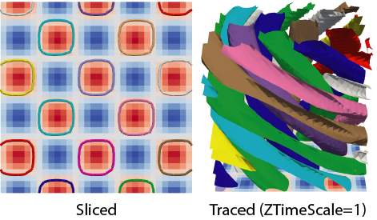

# FTK ParaView Guide

## Limitations

FTK's features are partially implemented in ParaView plug-ins.  We are addressing the following limitations for future releases:

* We do not currently support distributed and parallel processing with ParaView plug-ins.  One can compile FTK with MPI and use `mpiexec` to execute `ftk` in order to track features with multiple processes
* We have limited support for CUDA-accelerated filters.  One can compile FTK with CUDA and use `--accelerator cuda` to accelerate computation with a GPU
* Performance of our filters (especially 4D filters) may not be optimized because of MPI/CUDA support is missing
* Filters are only supported for `vtkImageData` types for now; use C++ APIs for unstructured mesh data
* Post-processing of outputs, e.g. smoothing, simplification, and filtering of critical point trajectories not yet supported in ParaView plug-ins

## Installation

Currently, the only way to install FTK's ParaView plug-ins is to build from source.  See [install.md](install.md) for more details.

## FTK synthetic data sources

See [synthetic.md](synthetic.md) for a comprehensive list of synthetic data sources that are supported

## FTK Filters

### `CriticalPointTracker2D`

This filter tracks critical points in 2D scalar and vector fields.  

#### Inputs

The input must be in 2D `vtkImageData` type.  We currently do not support `vtkUnstructuredGrid` as the input.

The filter automatically determines whether the input is a scalar or vector field based on the number of components of the input variable:

* The input is treated as a scalar field if the input variable contains one single component.  For example, the `scalar` variable provided by `MovingExtremum2DSource` is a scalar field because the variable contains one single component 
* The input is treated as a vector field if the input variable contains multiple components.  For example, the `vector` variable provided by the `DoubleGyre2DSource` is a vector field because the variable contains more than one components
* If a vector field is provided by two different variables, say  `u` and `v`, one has to combine the two variables into a multi-component variable using the `Calculator` filter with `iHat*u + jHat*v`; otherwise `u` or `v` will be treated as a scalar field.

#### Options

* `InputVariable` specifies the input variable
* `ZTimeScale` (by default zero) controls the ratio of z-coordinates over time in the outputs, which can be used to generate spacetime visualizations in 3D (x and y being space and z being time).  This option is by default zero in order to behave consistently as `CriticalPointTracker3D`, which is not possible to visualize spacetime visualizations in 3D

#### Outputs

The outputs are trajectories in `vtkPolyData` format with multiple variables:

* `id` are the integer identifiers of trajectories
* `time` are the time coordinates of each point
* `type` is the type of critical points.  See `ftk/numeric/critical_point_type.hh` for definitions

### `CriticalPointTracker3D`

This filter tracks critical points in 3D scalar and vector fields.  We omit descriptions because this filter behaves very similar to `CriticalPointTracker2D`.

### `LevelsetTracker2D`

This filter tracks level sets (contours) in 2D scalar fields.

#### Inputs

The input must be in 2D `vtkImageData` type; the input variable must contain one single component.  We currently do not support `vtkUnstructuredGrid` as the input.

#### Options

* `Threshold` (by default zero) is the the isovalue for levelest tracking
* `OutputType` controls whether the outputs are "sliced" (contours in individual timesteps) or "traced" (spacetime isosurfaces); see the above image
* `ZTimeScale` (by default zero) controls the ratio of z-coordinates over time in the outputs; see the `ZTimeScale` in `CriticalPointTracker2D` for more details

#### Outputs

The "sliced" outputs are contours in the  `vtkPolyData` format for each tilmestep; the "traced" outputs are surfaces in the `vtkPolyData` format.  The outputs have multiple variables:

* `id` are the integer identifiers of trajectories
* `time` are the time coordinates of each point

### `LevelSetTracker3D`

This filter tracked levelests (contours) in 3D scalar fields.  We omit descriptions because this filter behaves very similar to `LevelSetTracker3D`.
